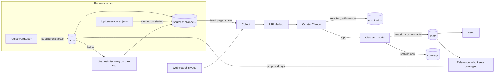
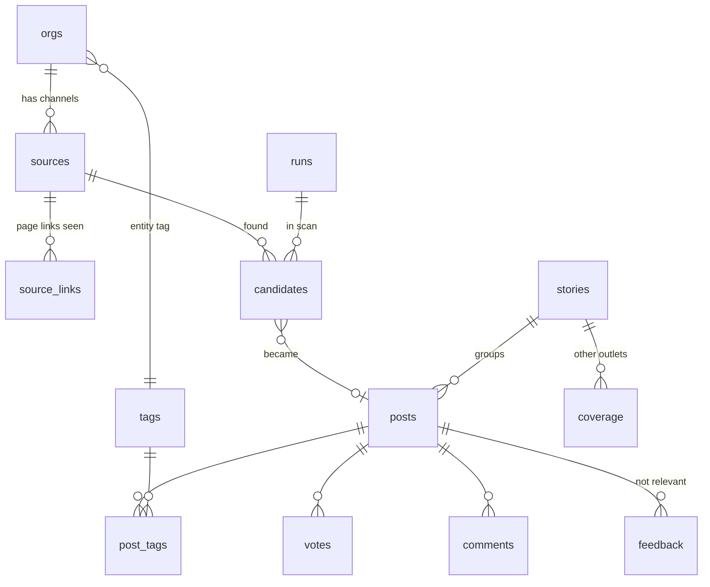

# How News works

This is the map of the system: what runs, what a scan does, how sources are organised, and
where every piece of data lives. If you want to change behaviour, the "Where to change it"
column tells you which file to open.

## The short version

1. Twice a day, the worker reads every channel we know about for every organisation we follow.
2. It adds what web search finds on top.
3. Claude throws out what doesn't belong, describes what does, and groups repeats into stories.
4. Posts land in the feed. Every decision, including every rejection, is logged.
5. After posting, the system counts which organisations keep coming up, and suggests new ones
   to follow.

## What runs

Three containers, defined in `docker-compose.yml`:

| Container | What it does | Code |
|---|---|---|
| `db` | Postgres 16. The only place data is stored. | `app/migrations/*.sql` |
| `web` | The site and its API. Serves `/`, `/sources`, `/runs`. | `app/web.py` |
| `worker` | Runs scans at 04:00 and 13:00 UK time, and whenever someone presses "Scan now". | `app/worker.py` |

Both `web` and `worker` apply migrations and sync config into the database on startup
(`app/seed.py`). A lock makes that safe when they start together.

## Known sources

This is the part that decides what we can see, so it has its own model.

### Organisations and channels

An **organisation** is someone we follow: OpenAI, Salesforce, the ICO, Simon Willison. A
**channel** is one place they publish: a newsroom, a blog feed, an X account, a LinkedIn page, a
YouTube channel, a Substack. One organisation has many channels.

Each channel has a **read mode**, which says how (or whether) we check it:

| Read mode | What happens | Typical channels |
|---|---|---|
| `rss` | Fetch the feed, keep entries newer than the lookback window. | Blogs, newsrooms with feeds, Substack, YouTube, Bluesky, podcasts |
| `page` | Fetch an HTML listing page, record every article link, report only links we haven't seen before. | Newsrooms with no feed |
| `x` | Read the account's new posts through the X API. Off unless `X_BEARER_TOKEN` is set. | X accounts |
| `hn` | Hacker News stories above a points threshold. | Topic feeds only |
| `none` | Stored as a link for people to click. Not checked. | LinkedIn, Instagram, GitHub, X without a token |

Organisations nothing can poll are not ignored. Each scan, web search is asked to check a few
of them (the **sweep**), oldest-checked first. See "Web search sweep" below.

### What each platform allows

| Platform | Can we poll it? | How |
|---|---|---|
| Company sites, blogs, newsrooms | Yes | Feed if they have one, otherwise page watching |
| Substack | Yes | Every Substack has `/feed` |
| YouTube | Yes | Every channel has a public RSS feed; discovery finds its channel id |
| Bluesky | Yes | Every profile has `/rss` |
| X | Yes, paid | Official API, pay per use. As of September 2026, X charges about $0.005 per post read and $0.01 per account lookup. We look each account up once, then only ask for posts newer than the last one we saw, and skip replies and reposts. `X_MAX_READS_PER_RUN` caps the spend. 25 accounts posting 3 times a day each is roughly $10 a month. |
| LinkedIn | No | There's no public API for reading a company's posts, and scraping breaks their terms. Stored as a link, covered by web search. |
| Threads, Instagram, GitHub | No | Stored as links. GitHub release feeds can be added per repo as `rss`. |

### Tier and priority

- **Tier** controls how strict the curator is. Tier 1 channels are on-topic by design, so their
  items pass unless they're junk (an AI lab's blog). Tier 2 channels publish plenty beyond the
  topic, so items must be about AI to pass (Salesforce's newsroom, a security news site).
- **Priority** controls how often we check. `core` organisations are checked every scan.
  `watch` organisations are checked once a day (`WATCH_CHECK_HOURS`).

Official channels also mark their items as a **primary source** for the curator, and every post
from an organisation's own channel is tagged with that organisation. `?t=salesforce` shows
everything from or about Salesforce.

### Where a source comes from

| Origin | Meaning |
|---|---|
| `seed` | Written in `registry/orgs.json` or a topic's `sources.json`. Written by hand, checked on first read. |
| `discovered` | Found on the organisation's own website by channel discovery. |
| `added` | Pasted in on the Sources page. |

### Channel discovery

When we follow an organisation that has a website, the system reads the site to find its
channels. It runs automatically for new orgs (a few per scan, `CHANNEL_DISCOVERY_PER_RUN`), when
you follow a suggestion, and when you press "Find channels on their site".

1. Read the homepage for `<link rel="alternate">` feeds, and for links to social profiles.
   Most sites link their X, LinkedIn and YouTube in the header or footer. Share buttons are
   ignored.
2. Follow up to three same-site links that look like a newsroom, press page or blog. Look for
   feeds there. A newsroom with no feed but plenty of article links becomes a `page` channel.
3. If there's still no feed, try the usual paths (`/feed`, `/rss.xml`, `/atom.xml` and so on).
4. Turn a YouTube channel into its RSS feed, a Substack into `/feed`, a Bluesky profile into
   `/rss`.

Every feed is test-parsed before it's saved. Code: `app/sources/channels.py`.

### Page watching

For newsrooms without a feed (`app/sources/fetch.py`):

- The **first read is a baseline**. Every article link on the page is recorded in
  `source_links` and nothing is posted, so following a new newsroom never floods the feed
  with its back catalogue.
- After that, only links not seen before are reported. The first few new links each get one
  more request, to read their real title, description and publish date.
- An old article that resurfaces in a "related" widget is dropped by its publish date.
- A page with no article-looking links is marked failing, with a message saying so. That
  usually means the page is built by JavaScript. Set a `link_pattern` (a regex article URLs
  must match) in the registry, or find their feed.

### Relevance: who should we follow?

Two signals, both automatic (`app/sources/relevance.py`):

- **Mentions.** The curator names the organisations central to each post. Those become entity
  tags, with aliases folded in (Alphabet and Google Research both count for Google).
  An organisation's `mention_count` is its tagged posts in the last 30 days.
- **Search hits.** Web search keeps landing on a site that isn't in the registry.

An unknown entity with `ORG_PROPOSE_THRESHOLD` posts (default 3) in `ORG_PROPOSE_WINDOW_DAYS`
(default 14), or a site with that many search hits, shows up under "Suggested to follow" on
`/sources`, with the posts that triggered it. If the organisation's own domain appears in those
posts, its website is filled in. Follow it and channel discovery runs straight away. Dismiss it
and it stays dismissed.

### Web search sweep

Followed organisations with no working polled channel (only LinkedIn, say, or X without a token)
are handed to web search, `ORG_SWEEP_PER_RUN` at a time (default 8), core priority first, then
least recently checked. The discovery prompt asks for any official announcement from them in
the window. Anything found on their own site is attributed to them as a primary source.

## A scan, step by step

`app/pipeline/run.py` orchestrates. Each step writes what it decided, so `/runs` can show it.

| Step | What it does | Reads | Writes | Where to change it |
|---|---|---|---|---|
| 1. Collect | Reads every due channel in parallel (`FETCH_WORKERS`). Sends ETag and Last-Modified, so an unchanged feed costs a 304. Updates each channel's health. | `sources`, `orgs`, `source_links` | `sources` (health, cache headers, X cursor), `source_links` | `app/pipeline/collect.py`, `app/sources/fetch.py`, `app/sources/xapi.py` |
| 2. Discover | Claude web search over the topic's queries plus the sweep list. Keeps only URLs that really appeared in search results. | `orgs` | `orgs` (search hits, proposals) | `topics/ai/topic.json`, `app/pipeline/prompts/discovery.md` |
| 3. Dedup | Normalises URLs. Anything seen before, in any topic, is dropped. When one URL arrives by several routes, the feed copy wins over X, HN or search. | `candidates` | `candidates` | `app/normalize.py` |
| 4. Curate | Claude keeps or rejects each item against the lens, with the team's recent "Not relevant" flags and upvotes as examples. Writes summaries, scores, tags. | `candidates`, `feedback`, `votes`, `orgs` | `candidates` (decision, reason) | `topics/ai/lens.md`, `topics/ai/taxonomy.json`, `app/pipeline/prompts/curate.md` |
| 5. Cluster | Fuzzy title match finds candidate stories. Claude decides same story or not, and whether there are new facts. | `stories`, `posts` | `stories`, `posts`, `coverage`, `post_tags` | `app/pipeline/prompts/cluster.md`, `app/pipeline/cluster.py` |
| 6. Story tags | Stories with `STORY_TAG_THRESHOLD` articles get their own tag. | `stories` | `tags`, `post_tags` | `app/pipeline/cluster.py` |
| 7. Upkeep | Recount mentions, propose orgs, run channel discovery for a few new orgs. | `post_tags`, `orgs` | `orgs`, `sources` | `app/sources/relevance.py`, `app/sources/channels.py` |

Caps keep a scan bounded: `MAX_LLM_CALLS_PER_RUN`, `MAX_SEARCHES_PER_RUN`,
`MAX_CANDIDATES_PER_RUN`, `X_MAX_READS_PER_RUN`. A run that hits a cap stops cleanly and says so
on `/runs`.

## Where everything is stored

### Files (in the repo, edited by people)

| File | What it holds | Who owns it after startup |
|---|---|---|
| `registry/orgs.json` | Organisations and their seeded channels | The file owns names, kinds, websites, aliases and seeded channels. The database owns status and priority, because those change on `/sources`. |
| `topics/<slug>/topic.json` | Topic name, discovery queries, lens tag, similar sites | File |
| `topics/<slug>/lens.md` | Who the feed is for and what to boost | File |
| `topics/<slug>/taxonomy.json` | Category tags the curator may use | File |
| `topics/<slug>/sources.json` | Feeds that belong to a topic, not an org (Hacker News, subreddits, government search feeds) | File |
| `app/pipeline/prompts/*.md` | Curator, story editor and discovery prompts | File |
| `.env` | Keys, identity, schedule, caps. Never committed. | File |

Seeding adds and updates. It never deletes. Removing an org from the registry leaves it in the
database; unfollow it on `/sources`.

### Database tables (Postgres, the `news-db` volume)

| Table | One row is | Written by | Read by |
|---|---|---|---|
| `orgs` | An organisation, followed, proposed or dismissed | Seed, relevance, Sources page | Collect, sweep, curator, Sources page |
| `sources` | A channel: its URL, read mode, tier, health, cache headers, X cursor | Seed, channel discovery, Sources page, collect (health) | Collect, Sources page |
| `source_links` | An article link already seen on a watched page | Page watching | Page watching |
| `runs` | A scan, with its stats and any error | Scan | `/runs` |
| `scan_requests` | A "Scan now" press waiting for the worker | Web | Worker |
| `candidates` | Every item any scan found, with its decision and reason | Scan | `/runs`, source yield numbers |
| `stories` | One real-world event | Cluster | Cluster, feed |
| `posts` | A feed entry: title, our summary, link, scores | Cluster | Feed, search |
| `coverage` | Another outlet's article about a story, folded under a post | Cluster | "N more sources" |
| `tags`, `post_tags` | Tags and which posts carry them | Seed, curator, cluster, people | Feed filters, typeahead, relevance |
| `votes`, `comments`, `feedback` | What the team did | Web | Feed, curator (feedback and votes) |

We store summaries, titles and links. We never store article text.

### How good is each source?

Every candidate keeps the channel and organisation it came from, so yield is a query, not a
counter. `/sources` shows, per channel and per organisation, how many items were found and how
many were posted in the last 30 days, plus when it last produced something new. A channel that
finds a lot and posts nothing is noise. A channel that never finds anything is dead or broken.

## Common tasks

| I want to | Do this |
|---|---|
| Follow a new company | `/sources`, "Follow someone new", give its website. Channel discovery fills in the rest. Or add it to `registry/orgs.json`. |
| Add a channel someone mentioned | Open the org on `/sources`, paste the link, "Add channel". The type is worked out from the URL. |
| Fix a failing feed | The error is on `/sources`. Paste the right URL as a new channel, remove the old one. A channel pauses itself after 5 failures in a row. |
| Watch a JavaScript newsroom | Add a `link_pattern` for it in the registry, or find its feed. |
| Check someone less often | "Check daily instead" on the org. |
| Turn on X | Set `X_BEARER_TOKEN` and restart. Existing X channels start polling on the next scan. |
| See why something was rejected | `/runs`, pick the scan, "Rejected". |
| Change what counts as relevant | Edit `topics/ai/lens.md`. It moves the curator more than anything else. |

## Known limits

- An organisation followed by two topics is read once per topic. The first topic to see an item
  curates it. Fine with one topic; worth revisiting when there are several.
- Page watching can't see content that only appears after JavaScript runs.
- Web search results depend on what the search engine has indexed. X and LinkedIn posts often
  only show up once someone else links to them.
- Seeded URLs were written by hand. Health checks and channel discovery correct them over the
  first few scans; check `/sources` after the first run.
